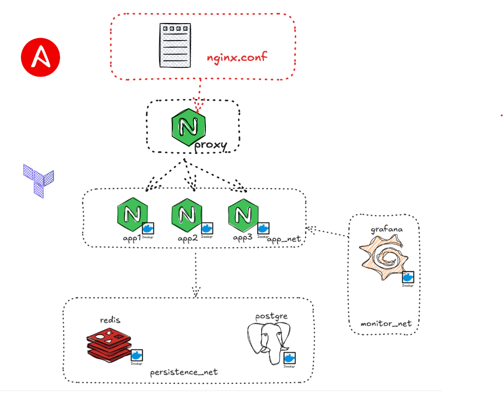

# Proyecto IAC - Semana 4 - Lab004

Este proyecto implementa un ambiente **DEV** con Terraform y Ansible:

- **Terraform**: despliega la infraestructura local usando contenedores Docker.
- **Ansible**: configura el contenedor **proxy** (Nginx) como balanceador de carga round-robin hacia tres aplicaciones.

Este proyecto reproduce la topología del diagrama: 

## Diagrama de topología



---

## 1) Requisitos previos

1. **Docker Desktop** instalado y funcionando en Windows (con integración WSL2 activada para Ubuntu).
2. **WSL2 con Ubuntu** (recomendado Ubuntu 22.04).  
3. **Terraform** instalado en WSL Ubuntu.  
4. **Ansible** instalado en WSL Ubuntu (`ansible --version` debe funcionar).  

---


## 2) Clonar el repositorio y ubicarse en la carpeta

```bash
git clone <URL-DE-ESTE-REPOSITORIO>
cd <carpeta-del-repositorio>
```

---

## 3) Inicialización y validación

```bash
terraform init
terraform workspace new dev
terraform workspace list
terraform workspace select dev
terraform fmt -recursive
terraform validate
```

---

## 4) Plan y Apply

  ```bash
  terraform plan  -var-file="secret.tfvars"
  terraform apply -var-file="secret.tfvars"
  ```

> Revisa el **plan** antes del apply. Si lo prefieres: `-auto-approve` para saltar la confirmación sino confirmar con un "yes".

---

## 5)Configurar el proxy con Ansible

Entrar en la carpeta `ansible` y ejecutar el playbook:

```bash
cd ansible
ansible-playbook -i inventory.ini playbook.yml -e workspace=dev
```

Esto:
- Renderiza `templates/nginx.conf.j2` → `proxy/default.conf`.
- Recarga Nginx dentro del contenedor `proxy-dev`.

---

## 6) Probar el balanceador

Abrir en navegador:
```
http://localhost:8080
```

Refrescar varias veces → deberías ver alternar **APP1 / APP2 / APP3**.

También puedes probar con `curl` para ver qué backend respondió:

```bash
curl -s -D - http://localhost:8080/ -o /dev/null | grep X-Upstream
```
---

## 7) Resultados esperados

- Balanceador Nginx en `http://localhost:8080` alternando entre `app1`, `app2`, `app3`.
- Apps responden con HTML distintos.
- Infra gestionada con **Terraform**.
- Config de proxy gestionada con **Ansible**.
---

## 8) Notas de seguridad

- NO HAGAS COMMIT DE `secret.tfvars`, `.terraform/`, ni `terraform.tfstate*`.  
- Se recomienda usar **versiones fijas** de imágenes (evita `latest`) 
- Redis sin password está **solo para DEV**; documenta si lo cambias.

---


