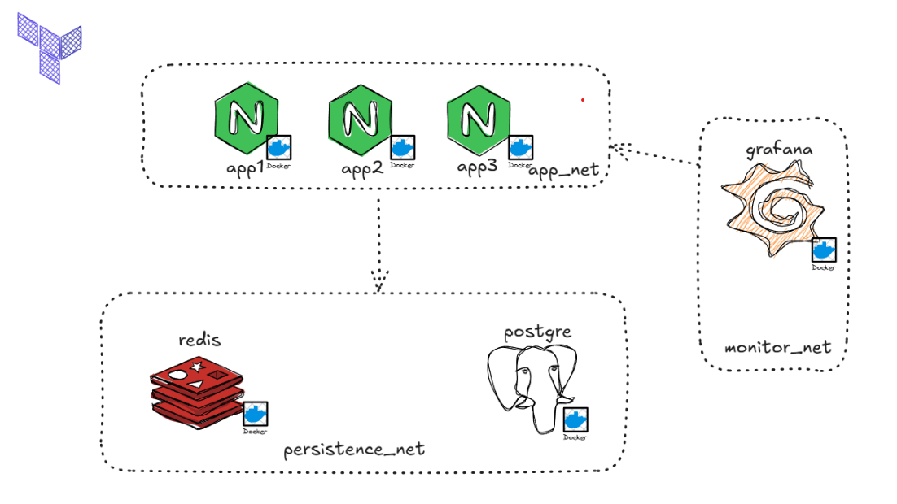

# Infraestructura DEV con Docker + Terraform (AppNet / MonitorNet / PersistenceNet)

Este proyecto reproduce la topología del diagrama: 

## Diagrama de topología



- **`app_net`**: tres apps **idénticas** (`app1`, `app2`, `app3`, imagen nginx)  
- **`monitor_net`**: **Grafana**  
- **`persistence_net`**: **Redis** y **PostgreSQL**  
---

## 1) Requisitos

- **Docker** instalado y corriendo 
- **Terraform** ≥ 1.5 instalado
  - **Redis CLI** (`redis-cli`)  
  - **PostgreSQL** (`psql`)  
  > Si te da problemas al instalar , más abajo te indico cómo probar usando **solo Docker**.

---

## 2) Clonar el repositorio y ubicarse en la carpeta

```bash
git clone <URL-DE-ESTE-REPOSITORIO>
cd <carpeta-del-repositorio>
```

---

## 3) Variables

### 3.1 `terraform.tfvars` 
Define los **puertos** por workspace y parámetros no sensibles.
### 3.2 `secret.tfvars` (NO lo subas al repo)
Crea un archivo **`secret.tfvars`** con contraseñas:

```hcl
grafana_admin_password = "cambia-esto por la contraseña que desees"
postgres_password      = "cambia-esto-tambien "
```

**.gitignore** debe excluir `secret.tfvars`.

---

## 4) Inicialización y validación

```bash
terraform init
terraform workspace new dev
terraform workspace list
terraform workspace select dev
terraform fmt -recursive
terraform validate
```

---

## 5) Plan y Apply

  ```bash
  terraform plan  -var-file="secret.tfvars"
  terraform apply -var-file="secret.tfvars"
  ```

> Revisa el **plan** antes del apply. Si lo prefieres: `-auto-approve` para saltar la confirmación sino confirmar con un "yes".

---

## 6) ¿Qué se crea?

- Redes: `app_net`, `monitor_net`, `persistence_net`  
- Contenedores:
  - `app1-dev`, `app2-dev`, `app3-dev` (nginx en `app_net`)  
  - `grafana-dev` (en `monitor_net`, expuesto a `${grafana_external_port[dev]}`)  
  - `redis-dev` y `postgres-dev` (en `persistence_net`, expuestos a sus puertos)  
- Volúmenes: `grafana_data_dev`, `redis_data_dev`, `postgres_data_dev`

Verifica rápido:

```bash
docker ps --format "table {{.Names}}\t{{.Image}}\t{{.Ports}}"
```

---

## 7) Verificación de servicios

### 7.1 Grafana (navegador)
- Abre: `http://localhost:3000` (o el puerto que definas en `terraform.tfvars`)  
- Usuario: `admin` (o el que tengas en `grafana_admin_user`)  
- Password: la de `secret.tfvars`

### 7.2 Redis
**Opción A – con cliente instalado**
```bash
redis-cli -h 127.0.0.1 -p 6379 ping
# Respuesta esperada: PONG
```

**Opción B – solo con Docker**
```bash
docker exec -it redis-dev redis-cli ping
```

### 7.3 PostgreSQL
**Opción A – con cliente instalado**
```bash
psql -h 127.0.0.1 -p 5432 -U admin -d appdb -c "\l"
```

**Opción B – solo con Docker**
```bash
docker exec -it postgres-dev psql -U admin -d appdb -c "select now();"
```

### 7.4 Apps (`app1`, `app2`, `app3`) dentro de `app_net`

Navegador:
- `http://localhost:8081`, `http://localhost:8082`, `http://localhost:8083`

(En realidad no era necesario exponer los puertos solo para comodidad visual)


---

## 8) Estructura de archivos (resumen)

```
main.tf                # provider docker
network.tf             # monitor_net
app_net.tf             # app_net + app1/app2/app3 (nginx)
grafana.tf             # grafana en monitor_net
persistence_net.tf     # redis y postgres en persistence_net
variables.tf           # variables (mapas por workspace, sensibles, etc.)
terraform.tfvars       # puertos y valores no sensibles (por workspace)
secret.tfvars          # contraseñas (NO subir)
```

---

## 9) Notas de seguridad

- NO HAGAS COMMIT DE `secret.tfvars`, `.terraform/`, ni `terraform.tfstate*`.  
- Se recomienda usar **versiones fijas** de imágenes (evita `latest`) 
- Redis sin password está **solo para DEV**; documenta si lo cambias.

---


